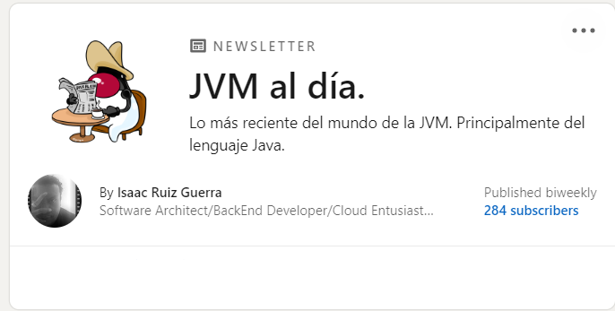

# javaAldia
Repositorio relacionado al newsletter: Java al Día.

Puedes subscribirte al Newsletter aquí:
https://www.linkedin.com/newsletters/6931281718834335744/

## 📬 Newsletter

Mantente al día con mis últimas publicaciones y actualizaciones suscribiéndote a mi [newsletter](https://www.linkedin.com/newsletters/6931281718834335744/). Aquí puedes encontrar las ediciones más recientes:

### 2025
| 📌 | 📖 Artículo | 📅 Fecha |
|----|-----------|---------|
| 📖 | [Optional. Más de lo que pensamos.](https://www.linkedin.com/pulse/optional-m%25C3%25A1s-de-lo-que-pensamos-isaac-ruiz-guerra-nfnje/) | Mayo 16, 2025 |
| 📖 | [Java 8 fue un regalo… que se convirtió en una trampa.](https://www.linkedin.com/pulse/java-8-fue-un-regalo-que-se-convirti%C3%B3-en-una-trampa-isaac-ruiz-guerra-g6cve/) | April 30, 2025 |
| 📖 | [Garbaje Collector. Parte 2. Lo nuevo.](https://www.linkedin.com/pulse/garbaje-collector-parte-2-lo-nuevo-isaac-ruiz-guerra-utqge/) | April 23, 2025 |
| 📖 | [Garbage Collector. Parte 01. Esto hace.](https://www.linkedin.com/pulse/garbage-collector-parte-01-esto-hace-isaac-ruiz-guerra-ho6ee/) | April 14, 2025 |
| 📖 | [Virtual Threads. Lo nuevo.](https://www.linkedin.com/pulse/virtual-threads-lo-nuevo-isaac-ruiz-guerra-iatle/) | April 07, 2025 |
| 📖 | [Virtual Threads. Preludio.](https://www.linkedin.com/pulse/virtual-threads-preludio-isaac-ruiz-guerra-mb7qf/) | April 04, 2025 |
| 📖 | [Scoped Values. Nada se pierde, todo en su lugar.](https://www.linkedin.com/pulse/scoped-values-nada-se-pierde-todo-en-su-lugar-isaac-ruiz-guerra-w1zre/) | March 25, 2025 |
| 📖 | [String Templates. O del porqué es bueno visitar los cementerios).](https://www.linkedin.com/pulse/string-templates-o-del-porqu%C3%A9-es-bueno-visitar-los-isaac-ruiz-guerra-iepbe/) | March 18, 2025 |
| 📖 | [Records. La elegancia de lo sencillo (o la sencillez de la elegancia).](https://www.linkedin.com/pulse/records-la-elegancia-de-lo-sencillo-o-sencillez-isaac-ruiz-guerra-wujue/) | March 10, 2025 |
| 📖 | [Switch. Así ha cambiado desde java 12 hasta java 24.](https://www.linkedin.com/pulse/switch-as%C3%AD-ha-cambiado-desde-java-12-hasta-24-isaac-ruiz-guerra-c8qse/) | March 4, 2025 |
### 2024
| 📌 | 📖 Artículo | 📅 Fecha |
|----|-----------|---------|
| 📖 | [2025. Habemus LTS.](https://www.linkedin.com/pulse/2025-habemus-lts-isaac-ruiz-guerra-yfxae/) | December 29, 2024 |
| 📖 | [Un hechizo sencillo, pero inquebrantable.](https://www.linkedin.com/pulse/un-hechizo-sencillo-pero-inquebrantable-isaac-ruiz-guerra-pggmf/) | November 22, 2024 |
| 📖 | [JConf-MX 2024. ¡¡¡Guadalajara, Guadalajara!!!](https://www.linkedin.com/pulse/jconf-mx-2024-guadalajara-guadalara-isaac-ruiz-guerra-ormye/) | October 5, 2024 |
| 📖 | [Programar (también) te hace (o al menos te ayuda a ser un poco más) responsable. Parte I .](https://www.linkedin.com/pulse/programar-tambi%C3%A9n-te-hace-o-al-menos-ayuda-ser-un-poco-ruiz-guerra-agz8e/) | July 7, 2024 |
| 📖 | [No saber (a veces también) ayuda a la innovación. Una anécdota con el OCR.](https://www.linkedin.com/pulse/saber-veces-tambi%C3%A9n-ayuda-la-innovaci%C3%B3n-una-an%C3%A9cdota-con-ruiz-guerra-o0dje/) | June 10, 2024 |
| 📖 | [Java 22. Sí, ya pasaron 6 meses.](https://www.linkedin.com/pulse/java-22-s%C3%AD-ya-pasaron-6-meses-isaac-ruiz-guerra-ehqge/) | March 18, 2024 |
| 📖 | [¿Quo vadis, Duke?.](https://www.linkedin.com/pulse/quo-vadis-duke-isaac-ruiz-guerra-8sdpe/) | January 24, 2024 |
### 2023
| 📌 | 📖 Artículo | 📅 Fecha |
|----|-----------|---------|
| 📖 | [Felices Fiestas-2023.](https://www.linkedin.com/pulse/felices-fiestas-2023-isaac-ruiz-guerra-uq2ne/) | December 22, 2023 |
| 📖 | [De lo presencial.](https://www.linkedin.com/pulse/de-lo-presencial-isaac-ruiz-guerra-g36ge/) | November 16, 2023 |
| 📖 | [Gracias por venir.](https://www.linkedin.com/pulse/gracias-por-venir-isaac-ruiz-guerra/) | July 18, 2023|
| 📖 | [Java. Native compilation.](https://www.linkedin.com/pulse/java-native-compilation-isaac-ruiz-guerra/) | April 19, 2023 |
| 📖 | [Java. Migrar o no migrar.](https://www.linkedin.com/pulse/java-migrar-o-isaac-ruiz-guerra/) | January 8, 2023 |
### 2022
| 📌 | 📖 Artículo | 📅 Fecha |
|----|-----------|---------|
| 📖 | [Java. Las olas de ayer, y las de mañana.](https://www.linkedin.com/pulse/java-las-olas-de-ayer-y-ma%C3%B1ana-isaac-ruiz-guerra/) | December 20, 2022 |
| 📖 | [Java. Yo soy Duke.](https://www.linkedin.com/pulse/java-yo-soy-duke-isaac-ruiz-guerra/) | September 14, 2022 |
| 📖 | [Java; No todo es backend. JavaFX.](https://www.linkedin.com/pulse/java-todo-es-backend-javafx-isaac-ruiz-guerra/) | July 5, 2022 |
| 📖 | [Java, la cultura popular y JavaZone.](https://www.linkedin.com/pulse/java-la-cultura-popular-y-javazone-isaac-ruiz-guerra/) | June 15, 2022 |
| 📖 | [Java. 27 primaveras y las que faltan.](https://www.linkedin.com/pulse/java-mayo-y-sus-eventos-isaac-ruiz-guerra/) | May 29, 2022 |
| 📖 | [Java. Mayo y sus eventos.](https://www.linkedin.com/pulse/java-mayo-y-sus-eventos-isaac-ruiz-guerra/) | May 14, 2022 |
