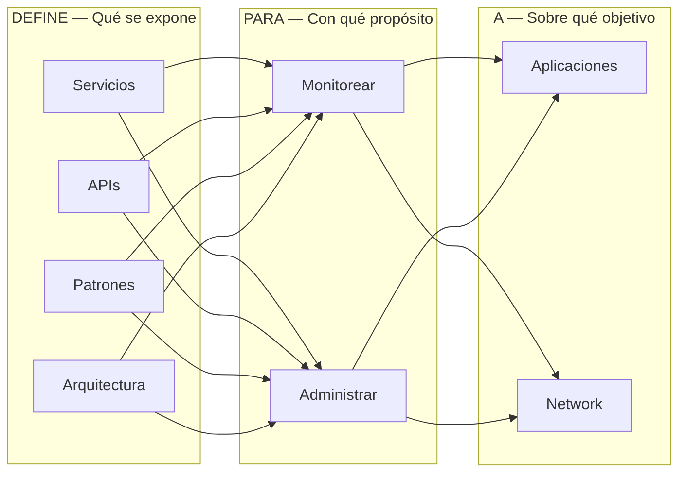

# Fundamentos

## Alcance.
El presente documento detalla en principio los fundamentos teóricos de la especificación 003. Java Management Extensions (JMX). Detalla cómo
crear un Standard MBean y pone las bases para continuar con la exploración de las potencialidades de esta especificación.

Este documento se publicó en Diciembre del 2016 en Oracle Technology Network, lo publico nuevamente para su mejor lectura pues la red OTN ha tenido cambios y algunos artículos dejaron de estar disponibles, incluyendo este.
Puedes ver una versión en PDF del artículo original aquí:

## Requerimientos.
El presente documento asume que se tiene cierta experiencia construyendo aplicaciones usando el lenguaje de programación java, asume también
que el lector tiene experiencia como desarrollador de aplicaciones y conoce en ese nivel un sistema operativo, por ende, sabe ejecutar tareas a nivel
CLI.

## Introducción.
Desde sus inicios, la plataforma java fue diseñada para tener un mecanismo que le permitiera administrarla y supervisarla de manera eficiente.
Prueba de ello, es que la especificación relacionada con este tema, es de las primeras; la 3 para ser más exacto. La creación de la especificación
fue aprobada en 1998, la primera versión fue liberada justo al siguiente año.

Actualmente la especificación se encuentra en su versión 1.4 (04 de marzo del 2014) y es sobre la cual se basa este documento.
La versión 2 de la especificación aún está en proceso y está cobijada por la JSR-0255.

Actualmente con la expectativa de crecimiento de IoT y de la creciente adopción de java en sistemas embebidos, JMX puede volver a resurgir en
importancia y penetración.

Esta es la principal motivación de escribir esta serie de artículos.  

Este documento está dividido en 3 bloques, el primero hace un resumen de los componentes que conforman la especificación, el 2o hace un muy
breve resumen de JConsole, una herramienta que estaremos utilizando a lo largo de los artículos de esta serie y por último se centra en la
construcción de un MBean standard.

La primera parte, de este documento es una adaptación de la especificación por lo que debe tomarse como tal.

## La necesidad de supervisar.
La supervisión es necesaria no solamente para los sistemas distribuidos (desde una perspectiva académica o de industria), también lo es para
sistemas internos o de menos complejidad. Siempre se requiere saber qué está ocurriendo con un ente en ejecución. Sobre todo, si para supervisar
o conocer el estado se requiere detener o interrumpir la ejecución.

Los sistemas de supervisión (management technologies) existen justo para saber qué es lo que está ocurriendo mientras algo está en ejecución.
Una de estas tecnologías es SNMP, si bien no es la única, sí es la más conocida.

El Protocolo Simple de Administración de Red/Simple Network Management Protocol es un protocolo creado para poder intercambiar información
entre dispositivos dentro de una red.

JMX no es un protocolo, pero, sí fue creado tomando en cuenta la existencia del SNMP e incluso está diseñado para poder lograr interacción entre
ambos.

Supervisar y administrar recursos en general, sean estos procesos, dispositivos físicos o elementos de una red es una tarea complicada pues se
requiere que en cada uno de los elementos a supervisar exista algo que pueda enviar información a un punto que centralice la información y que
además de centralizarla permita interactuar con esa información.

Este proceso de comunicación no debe crear overhead, y tampoco debe de consumir demasiados recursos.
En este documento veremos que ese algo en el contexto de JMX se conoce como agente y que ese punto centralizado se conoce como servidor.
Mientras más sencillo sea crear, colocar y administrar esos agentes y mientras más ligera sea la comunicación de estos con el servidor, más
eficiente es la tecnología de supervisión.

## JSR 03.  
Java Management Extensions (JMX) Specification es el nombre de esta JSR y es la que define por completo esta tecnología de la plataforma java,
la especificación ha recibido pocas actualizaciones, eso habla de lo bien que fue diseñada.
Actualmente está en su 4º ciclo de mantenimiento y, la versión 2 aún no tiene fecha de salida, así que, por ahora, la versión 1.x seguirá siendo la
referencia principal.

Una gran ventaja de los JSRs es que por definición deben iniciar con una descripción clara y concisa del objetivo su objetivo.
Veamos como inicia la especificación:

Los siguientes son fragmentos de una traducción libre de la especificación.

--- 

_The Java Management extensions (also called the JMX specification) define an architecture, the design patterns, the APIs, and the services for
application and network management and monitoring in the Java programming language._

JMX (Java Management extensions por sus siglas en inglés) define una arquitectura, patrones de diseño, API’s y los servicios para monitorear y
administrar aplicaciones y redes en el lenguaje de programación java.

Y continúa:

_It should be noted that, throughout the rest of the present document, the concept of management refers to both management and monitoring
services._
_The JMX architecture is divided into three levels:_

* _Instrumentation level._
* _Agent level._
* _Distributed services level._
  

Cabe señalar que, en el resto del presente documento, el concepto de _management_ se refiere tanto a los servicios de _administración_ como de _monitoreo._

La arquitectura JMX se divide en tres niveles:
* Nivel de instrumentación
* Nivel del agente
* Nivel de servicios distribuidos

--- 

La especificación hace una observación con la palabra "management", indicando que el concepto se refiere a partir de este momento tanto a la
administración como al monitoreo

Es importante tenerlo en cuenta pues, la especificación suele usar únicamente esta palabra dentro del documento.

Vamos a desglosar el 1er párrafo de la especificación de una manera un poco más gráfica para ver de mejor manera su alcance.
El objetivo de la especificación puede quedar explicado así:

_Figura 1. El objetivo de la JSR 03 visto de manera gráfica._

Si recuerdas tus clases de compiladores, puedes darte cuenta que, la imagen anterior bien puede convertirse en:

_Figura 2. Todo lo que podemos hacer con JMX._

Lo primero que llama la atención es que, la especificación incluye el monitoreo de redes, algo que muy pocos sabemos o pensamos que se podríahacer con JMX.

## ¿Por qué usar JMX?
Este es el listado de beneficios que se mencionan se obtienen al utilizar JMX:

* Permite gestionar las aplicaciones Java sin invertir grandes esfuerzos.
* Proporciona una arquitectura de administración escalable.
* Se integra a soluciones de supervisión existentes.
* Aprovecha las tecnologías Java estándar ya existentes.
* Puede aprovechar a futuro conceptos de supervisión.
* Define sólo las interfaces necesarias para la supervisión.

En la práctica, los beneficios se van observando conforme se aumenta su uso.

Es claro que son muchas las aplicaciones que la utilizan, principalmente en el mundo JEE, pero su uso no está limitado a este subconjunto de especificaciones. 

Aplicaciones de escritorio, embebidas y remotas le sacan también provecho a esta tecnología.

## Visión general.
La especificación continúa dándonos un resumen tanto de la arquitectura como de los componentes que la conforman.

## Arquitectura.
La arquitectura es sencilla, son 3 los niveles de abstracción que se utilizan.

### Los 3 niveles de la especificación.
La especificación requiere 3 niveles de abstracción:
* Instrumentación.
* Agente.
* Servicios distribuidos.

Estos 3 niveles en conjunto son los que se encargan de que la especificación pueda funcionar.

_Figura 2. Los 3 niveles de abstracción de la JSR 03._

Los niveles pueden verse siguiendo esa jerarquía, de arriba hacia abajo (abajo la más sencilla y sube en complejidad), para indicar la secuencia quese debe seguir para poder implementar o usar JMX en nuestras aplicaciones java.

Demos un repaso de cada nivel.

### Nivel de instrumentación.

El primer nivel, el de instrumentación proporciona las especificaciones requeridas para implementar: JMX manageable resources, algo quepodríamos traducir como: recursos
supervisables JMX ( dejaremos el nombre en inglés para mantener la referencia con otros documentos).

Un <JMX manageable resource> puede ser:

