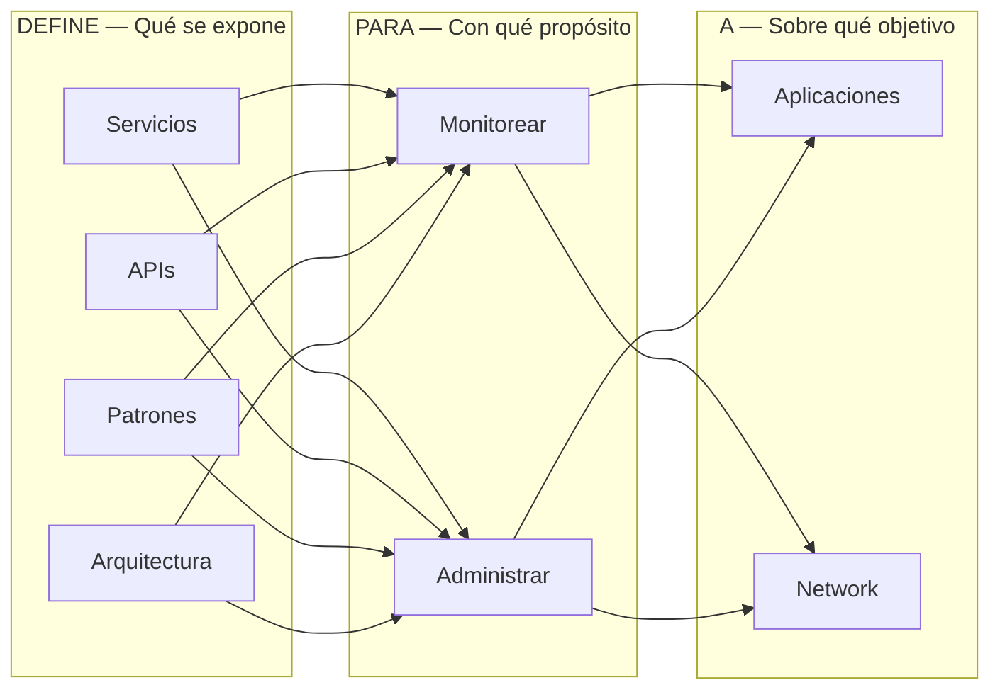
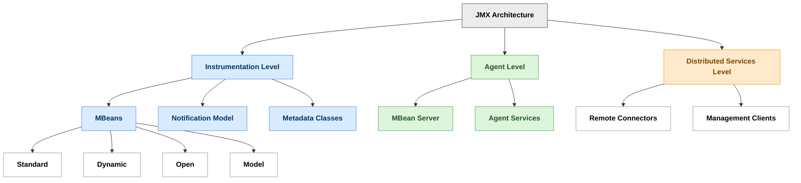
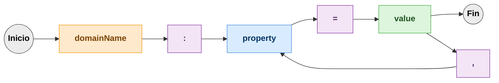
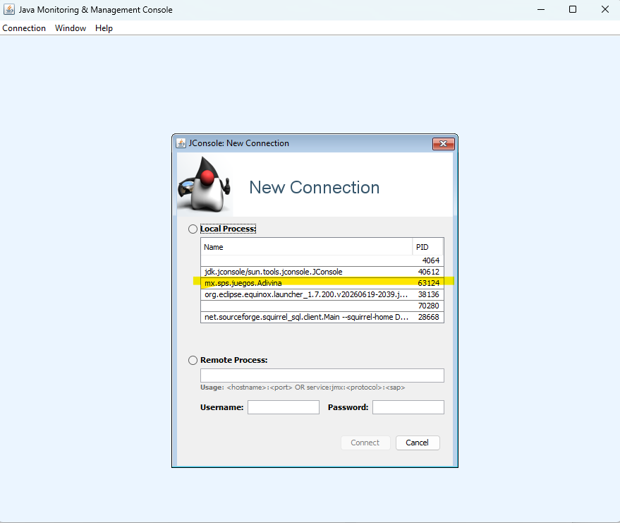
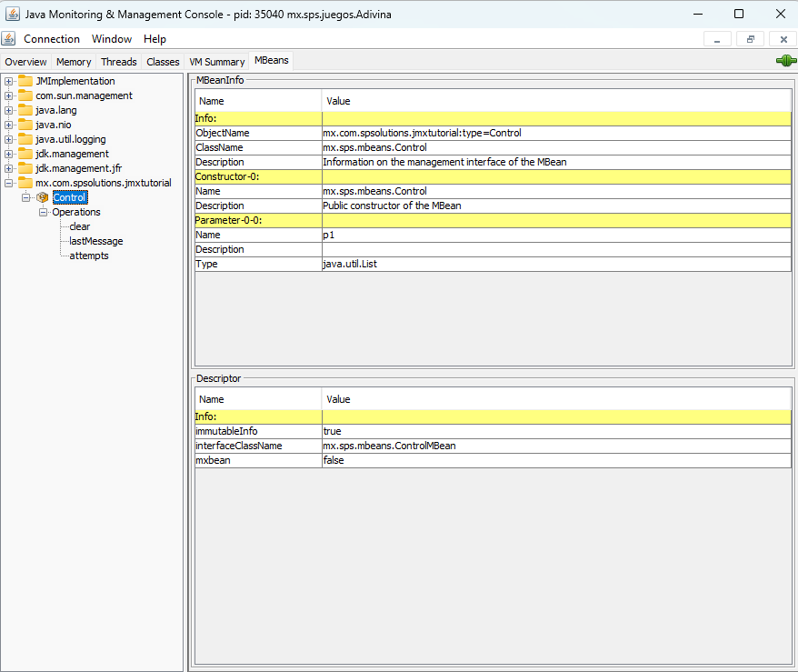
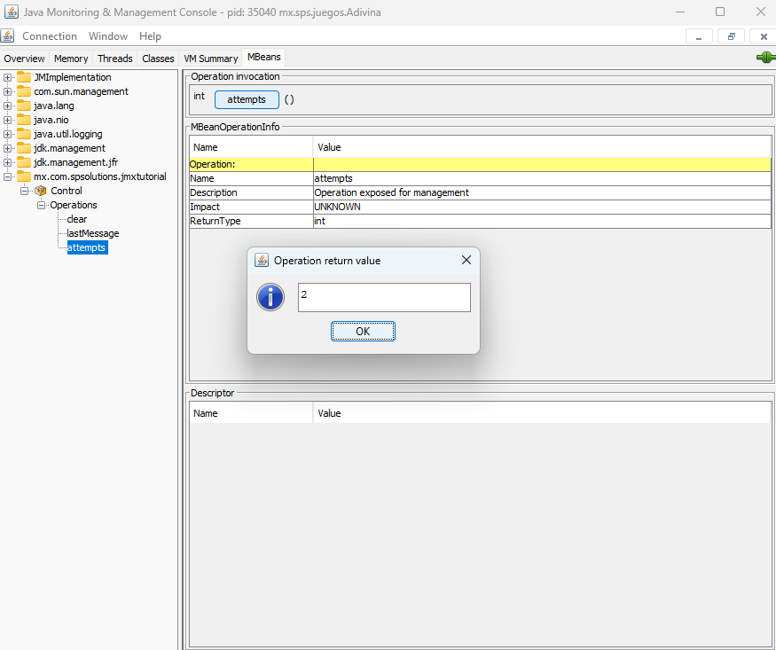
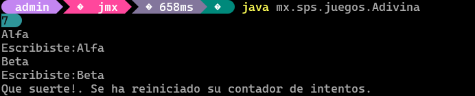
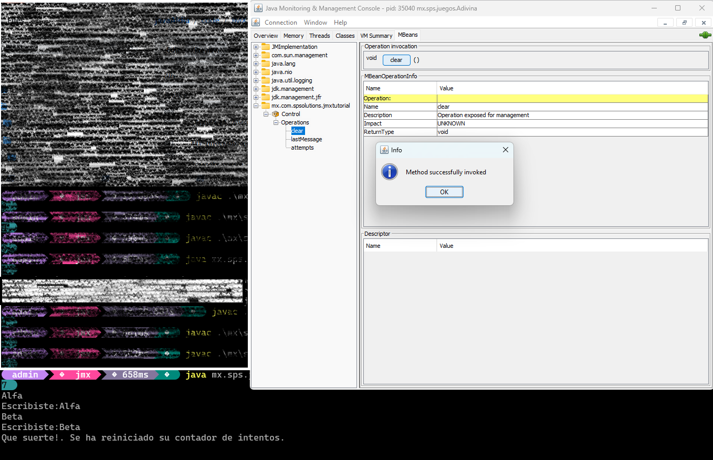

# Fundamentos

## Alcance.
El presente documento detalla en principio los fundamentos teóricos de la especificación 003. Java Management Extensions (JMX). Detalla cómo
crear un Standard MBean y pone las bases para continuar con la exploración de las potencialidades de esta especificación.

<blockquote>
**Nota:**

_Este documento se publicó en Diciembre del 2016 en Oracle Technology Network, lo publico nuevamente para su mejor lectura pues la red OTN ha tenido cambios y algunos artículos dejaron de estar disponibles, incluyendo este._
_Puedes ver una versión en PDF del artículo original aquí:_
<a href="https://github.com/rugi/javaAldia/tree/main/ext/pdf">Respaldo de artículos de JMX en OTN.</a>
</blockquote>

## Requerimientos.
El presente documento asume que se tiene cierta experiencia construyendo aplicaciones usando el lenguaje de programación java, asume también
que el lector tiene experiencia como desarrollador de aplicaciones y conoce en ese nivel un sistema operativo, por ende, sabe ejecutar tareas a nivel
CLI.

## Introducción.
Desde sus inicios, la plataforma java fue diseñada para tener un mecanismo que le permitiera administrarla y supervisarla de manera eficiente.
Prueba de ello, es que la especificación relacionada con este tema, es de las primeras; la 3 para ser más exacto. La creación de la especificación
fue aprobada en 1998, la primera versión fue liberada justo al siguiente año.


Actualmente la especificación se encuentra en su versión 1.4 (04 de marzo del 2014) y es sobre la cual se basa este documento.
La versión 2 de la especificación aún está en proceso y está cobijada por la JSR-0255.


Actualmente con la expectativa de crecimiento de IoT y de la creciente adopción de java en sistemas embebidos, JMX puede volver a resurgir en
importancia y penetración.

Esta es la principal motivación de escribir esta serie de artículos.  

Este documento está dividido en 3 bloques, el primero hace un resumen de los componentes que conforman la especificación, el 2o hace un muy
breve resumen de JConsole, una herramienta que estaremos utilizando a lo largo de los artículos de esta serie y por último se centra en la
construcción de un MBean standard.

La primera parte, de este documento es una adaptación de la especificación por lo que debe tomarse como tal.

## La necesidad de supervisar.
La supervisión es necesaria no solamente para los sistemas distribuidos (desde una perspectiva académica o de industria), también lo es para
sistemas internos o de menos complejidad. Siempre se requiere saber qué está ocurriendo con un ente en ejecución. Sobre todo, si para supervisar
o conocer el estado se requiere detener o interrumpir la ejecución.


Los sistemas de supervisión (management technologies) existen justo para saber qué es lo que está ocurriendo mientras algo está en ejecución.
Una de estas tecnologías es SNMP, si bien no es la única, sí es la más conocida.

El Protocolo Simple de Administración de Red/Simple Network Management Protocol es un protocolo creado para poder intercambiar información
entre dispositivos dentro de una red.


JMX no es un protocolo, pero, sí fue creado tomando en cuenta la existencia del SNMP e incluso está diseñado para poder lograr interacción entre
ambos.


Supervisar y administrar recursos en general, sean estos procesos, dispositivos físicos o elementos de una red es una tarea complicada pues se
requiere que en cada uno de los elementos a supervisar exista algo que pueda enviar información a un punto que centralice la información y que
además de centralizarla permita interactuar con esa información.


Este proceso de comunicación no debe crear overhead, y tampoco debe de consumir demasiados recursos.
En este documento veremos que ese algo en el contexto de JMX se conoce como agente y que ese punto centralizado se conoce como servidor.
Mientras más sencillo sea crear, colocar y administrar esos agentes y mientras más ligera sea la comunicación de estos con el servidor, más
eficiente es la tecnología de supervisión.

## JSR 03.  
Java Management Extensions (JMX) Specification es el nombre de esta JSR y es la que define por completo esta tecnología de la plataforma java,
la especificación ha recibido pocas actualizaciones, eso habla de lo bien que fue diseñada.
Actualmente está en su 4º ciclo de mantenimiento y, la versión 2 aún no tiene fecha de salida, así que, por ahora, la versión 1.x seguirá siendo la
referencia principal.


Una gran ventaja de los JSRs es que por definición deben iniciar con una descripción clara y concisa del objetivo su objetivo.
Veamos como inicia la especificación:

Los siguientes son fragmentos de una traducción libre de la especificación.

--- 

_The Java Management extensions (also called the JMX specification) define an architecture, the design patterns, the APIs, and the services for
application and network management and monitoring in the Java programming language._

JMX (Java Management extensions por sus siglas en inglés) define una arquitectura, patrones de diseño, API’s y los servicios para monitorear y
administrar aplicaciones y redes en el lenguaje de programación java.

Y continúa:

_It should be noted that, throughout the rest of the present document, the concept of management refers to both management and monitoring
services._
_The JMX architecture is divided into three levels:_

* _Instrumentation level._
* _Agent level._
* _Distributed services level._
  

Cabe señalar que, en el resto del presente documento, el concepto de _management_ se refiere tanto a los servicios de _administración_ como de _monitoreo._

La arquitectura JMX se divide en tres niveles:
* Nivel de instrumentación
* Nivel del agente
* Nivel de servicios distribuidos

--- 

La especificación hace una observación con la palabra "management", indicando que el concepto se refiere a partir de este momento tanto a la
administración como al monitoreo

Es importante tenerlo en cuenta pues, la especificación suele usar únicamente esta palabra dentro del documento.


Vamos a desglosar el 1er párrafo de la especificación de una manera un poco más gráfica para ver de mejor manera su alcance.
El objetivo de la especificación puede quedar explicado así:


_Figura 1. El objetivo de la JSR 03 visto de manera gráfica._


Si recuerdas tus clases de compiladores, puedes darte cuenta que, la imagen anterior bien puede convertirse en:


_Diagrama 1. Todo lo que podemos hacer con JMX._


Lo primero que llama la atención es que, la especificación incluye el monitoreo de redes, algo que muy pocos sabemos o pensamos que se podríahacer con JMX.

## ¿Por qué usar JMX?
Este es el listado de beneficios que se mencionan se obtienen al utilizar JMX:

* Permite gestionar las aplicaciones Java sin invertir grandes esfuerzos.
* Proporciona una arquitectura de administración escalable.
* Se integra a soluciones de supervisión existentes.
* Aprovecha las tecnologías Java estándar ya existentes.
* Puede aprovechar a futuro conceptos de supervisión.
* Define sólo las interfaces necesarias para la supervisión.

En la práctica, los beneficios se van observando conforme se aumenta su uso.

Es claro que son muchas las aplicaciones que la utilizan, principalmente en el mundo JEE, pero su uso no está limitado a este subconjunto de especificaciones. 

Aplicaciones de escritorio, embebidas y remotas le sacan también provecho a esta tecnología.

## Visión general.
La especificación continúa dándonos un resumen tanto de la arquitectura como de los componentes que la conforman.

## Arquitectura.
La arquitectura es sencilla, son 3 los niveles de abstracción que se utilizan.

### Los 3 niveles de la especificación.
La especificación requiere 3 niveles de abstracción:
* Instrumentación.
* Agente.
* Servicios distribuidos.

Estos 3 niveles en conjunto son los que se encargan de que la especificación pueda funcionar.


_Figura 2. Los 3 niveles de abstracción de la JSR 03._

Los niveles pueden verse siguiendo esa jerarquía, de arriba hacia abajo (abajo la más sencilla y sube en complejidad), para indicar la secuencia quese debe seguir para poder implementar o usar JMX en nuestras aplicaciones java.

Demos un repaso de cada nivel.

### Nivel de instrumentación.

El primer nivel, el de instrumentación proporciona las especificaciones requeridas para implementar: JMX manageable resources, algo quepodríamos traducir como: recursos
supervisables JMX (dejaremos el nombre en inglés para mantener la referencia con otros documentos).

Un _JMX manageable resource_ puede ser:

* Una aplicación.
* Una implementación de un servicio.
* Un dispositivo.
* Un usuario.
* Étcetera.

Está desarrollado en java o al menos ofrece un punto de acceso vía java, además de que ha sido instrumentado para ser supervisado poraplicaciones compatibles con JMX.
La pieza clave de este nivel son los Managed Beans, o MBeans.

Los MBeans pueden ser de tipo:
* Standard
* Dynamic

El tipo standard es el más sencillo, se basa en la especificación para los JavaBeans, el tipo Dynamic es más complejo y a cambio de esa complejidad ofrece una mayor flexibilidad en tiempo de ejecución.

Un _JMX manageable resource_ puede estar cubierto por uno o más MBeans.
Este nivel, además de los MBeans define las especificaciones para proporcionar un mecanismo de notificación. Este mecanismo de notificación permite a los MBeans generar y propagar eventos de notificación hacia componentes de los otros dos niveles.

Como todo nivel jerárquico, los elementos de este nivel, los _JMX manageable resource_ son manejados (de manera automática) por el siguientenivel: los agentes.


_Figura 3. Nivel de instrumentación y sus componentes._

### Nivel de agentes.

En este nivel se define todo lo relacionado con los agentes. Aquí es donde se gestiona el <JMX manageable resource> y se hace lo necesario paraque pueda ser manipulable de manera remota.

Este nivel recibe los MBeans y los gestiona automáticamente, los agentes generalmente están en la misma máquina que los <JMX manageableresource> pero esto no necesariamente es así.

Este nivel se puede englobar en dos grandes componentes:

* El MBean Server
* Servicios para manipular los MBeans.

Para ir familiarizándonos con la tecnología, tanto el servidor de MBeans como nuestro _JMX manageable resource_ a instrumentar vivirán en laJVM, pero, lo realmente poderoso de JMX es tener al servidor en otro contexto de ejecución.

Para ello la especificación agrega dos conceptos: Adaptadores y conectores, son componentes de comunicación que permiten unir al Server MBeancon el resto del mundo. Por ahora sólo es necesario que conozcamos de su existencia.

Como en el nivel anterior, este nivel solo se _"preocupa"_ por cumplir su parte de la especificación y los niveles adyacentes se encargarán de trabajaren conjunto.


_Figura 4. Nivel de Agente y sus componentes._

### Nivel de servicios distribuidos.

Este último nivel proporciona un conjunto de interfaces para implementar _JMX managers_.

En este nivel se definen una serie de interfaces cuyas tareas son:

* Proporcionar una interface para supervisar aplicaciones, para interactuar de manera transparente con el agente y los recursos que administra através de un conector.
* Distribuir información para la supervisión desde plataformas de supervisión de alto nivel hacia varios agentes JMX.
* Consolidar la información de supervisión procedente de numerosos agentes JMX en vistas lógicas que son relevantes para las operacionescomerciales del usuario final.
* Proveer seguridad.

En este nivel se implementan mecanismos de cooperación a través de la red, es justo aquí donde se proporcionan implementan las funcionalidadesde distribución, escalabilidad y supervisión. 

Es aquí también dónde se construyen las extensiones y demás mecanismos para hace de estatecnología adaptable, dinámica y segura.

## Componentes.

Ahora, ya que conocemos los niveles de abstracción, lo que sigue es conocer a detalle que componentes conforman cada uno de estos niveles.



_Figura 5. Visión general de los componentes que conforman la especificación JMX.._


Como podemos ver, es el nivel de instrumentación el que tiene más componentes a revisar, además del modelo de notificación es necesarioconocer los tipos de MBeans que se pueden implementar.
Por último, para terminar con este gran resumen; la siguiente imagen muestra con más detalle la relación entre componentes y cada uno de losniveles de arquitectura.


_Figura 6. Relación entre componentes y los niveles que forman la especificación JMX. Imagen tomada del documento oficial._

Esta última imagen puede parecer un poco compleja, pero, como veremos, la complejidad puede manejarse muy bien aislando los componentes yrevisándolos uno a uno.

Por ello, iniciaremos con el primer nivel, el de instrumentación. Crearemos un Mbean standard y conoceremos una manera sencilla para interactuarcon él.

_Manos a la obra._

## El 1er nivel.

### Nivel de instrumentación.

El primer nivel de la especificación es este, el de instrumentación, es el más ligero. Aquí es dónde se definen los recursos que queremosadministrar.

La pieza clave de este nivel es el MBean. Así que, veamos de que se trata.

### Managed MBean.

En términos sencillos, un MBean es una clase java que implementa una interface en específico y sigue cierto patrón en su implementación. Elobjetivo de seguir estas reglas es que el nivel superior, el nivel de agentes, pueda manipularlo de manera automática sin problemas; muy a su estiloJava ya tenía su manera de hacer
Convention over Configuration.

El objetivo es que el MBean defina de manera sencilla e inequívoca:

* Operaciones que puedan ser invocadas.
* Atributos que puedan ser accedidos.
* Notificaciones que puedan ser emitidas
* Constructores que puedan ser utilizados.

Los atributos siguen la convención que todos conocemos, si queremos tener un atributo en nuestro MBean debemos proporcionar un _getter_ y un _setter_ para cada uno de ellos.

Todo lo que definamos (siguiendo las reglas) en el MBean estará disponible para el agente.

La especificación define 4 tipos de MBeans.

| Tipo | ¿Cuándo usarlo? | Características |
|------|-----------------|-----------------|
| **Standard MBean** | Cuando el recurso es estable y conocido desde el diseño. | Fácil de implementar, interfaz fija y tipado fuerte. |
| **Dynamic MBean** | Cuando los atributos u operaciones pueden cambiar en tiempo de ejecución. | Flexible, implementa `DynamicMBean`, mayor complejidad. |
| **Open MBean** | Cuando el recurso debe ser interoperable con herramientas genéricas de gestión. | Usa `Open Types`, es auto-descriptivo y portable. |
| **Model MBean** | Cuando se requiere máxima configurabilidad sin modificar el código. | Configurable, auto-descriptivo y orientado a componentes reutilizables. |


### Notification Model.
Este nivel de la especificación define también un modelo genérico de notificación basado en el modelo de eventos de java. Las notificaciones laspuede emitir tanto un MBean como un server de MBeans.
La especificación define:

* Los objetos para realizar la notificación
* Interfaces para implementar los _Listeners_.
* Interfaces para implementar el _broadcast_.

Esto tanto para los que envían como los que reciben las notificaciones. Aquí también se definen los servicios necesarios para que estasnotificaciones puedan ser funcionales de manera remota.
MBean Metadata Classes.

Todos los anteriores MBean realmente extienden a este MBean. Estás clases contienen la estructura que describen todos los componentes de lainterface que maneja los MBeans, esto es:
* Atributos
* Operaciones
* Notificaciones y
* Constructores.

Es el servidor de MBean el que proporciona todos estos metadatos, y el que se encarga de implementarlos.

Ahora, continuamos revisando una herramienta que seguramente ya has utilizado.

## JConsole

JConsole es la herramienta que proporciona el JDK para poder acceder a los servidores de MBeans, como vimos anteriormente, es en estos servidores donde se hospedan los MBeans.
JConsole permite acceder tanto servidores locales como remotos, iniciaremos primero conociendo como conectarnos a un servidor local y enentregas posteriores veremos cómo conectarnos a servidores remotos.

### Iniciando.

Si tienes en el PATH local la carpeta /bin del JDK, solamente hay que escribir en una ventana de comandos:

``` bash
%>jconsole
```
Si no te reconoce el comando, debes agregar la carpeta bin de tu JDK al PATH, o acceder directamente a la carpeta y escribir:

``` bash
path_jdk/bin%>jconsole
```
o
``` powershell
path_jdk/bin%>jconsole.exe
```


Esto abrirá JConsole. La 1er pantalla nos permite elegir entre los procesos locales que están ejecutándose sobre nuestra JVM, todos ellos hacenuso de un servidor MBean local.

Vamos a conectarnos al proceso del propio JConsole. Es decir, usaremos JConsole, para revisar JConsole ;) .


_Figura 7. La propia JConsole tiene expuestos MBeans para poder supervisarla._

Después de hacer doble _click_ sobre el proceso al cual nos queremos conectar nos va a aparecer una advertencia de seguridad, esto se debe a que el servidor local de _MBeans_ por
_ default_ no están asegurados.

El aseguramiento de servidores de MBeans es un tema que se verá posteriormente.

 
 
_Figura 8. Advertencia de que la conexión segura no fue posible de realizar._


Debemos aceptar que usaremos una conexión insegura. Con esto, podemos continuar.

La primera pantalla que vemos nos muestra el consumo de recursos de JConsole, en la parte superior podemos ver todas las  fichas/tabs que ofrece la IU.


_Figura 9. Monitor principal del JConsole._

La pantalla inicial seguramente es ya conocida, nos muestra indicadores de desempeño del proceso: heap, threads, clases cargadas, y uso de CPU.

Hasta la derecha, podemos ver la ficha relacionada a los MBeans.
Como se puede ver, la lista de MBeans es extensa y se encuentran organizados en forma de árbol.

### Listado de MBeans disponibles.

El listado que aparece en esta pestaña representa todos los MBeans disponibles en esta conexión.


_Figura 10. Ficha MBeans dentro de JConsole, mostrando los MBeans disponibles._

Hay un MBean debajo de `java.lang`, llamado `Memory`, si hacemos _click_ sobre el `MBean` podemos ver sus principales propiedades, entre ellas hay una llamada _Object Name_, conoceremos en un momento su importancia.

Ahora, si hacemos click en él podremos ver las operaciones que expone.


_Figura 11. El object name del MBean que opera sobre la memoria._

La operación invoca al Garbage Collector _(realmente, como sabemos, GC() sólo sugiere la invocación, es la JVM la que decide ejecutarla o no)_.

Si hacemos _click_ en el botón, se realiza la invocación.


_Figura 12. Existe un MBean que permite invocar el Garbage Collector._

y si regresamos a la pestaña inicial podremos ver los efectos.


_Figura 13. Los efectos de invocar el Garbage Collector._

El tamaño de la memoria disminuye, pero, tiene un costo: uso de CPU.

Podemos cerrar JConsole, más adelante lo volveremos a usar.

### Nuestro primer MBean standard.

Ahora que ya sabemos cómo crear un MBean Standard, y ya sabemos cómo interactuar con uno usando JConsole, lo que necesitamos es unaaplicación que podamos monitorear y/o administrar.
Usaremos una aplicación sencilla, será sólo una clase java.

Esta clase te resultará conocida, es el ejemplo clásico para manejo de ciclos, en este caso un do-while.

El ejemplo hace uso de la clase Scanner para esperar una entrada por el teclado.

Una vez que se recibe la entrada de teclado (texto seguido de ENTER) se compara con una palabra de control, la cual termina con el ciclo. Si lapalabra introducida no es la palabra de control, el ciclo continúa.

Nos apoyamos en una clase llamada Adivina, el objetivo de esta clase es ir almacenando las palabas que se van introduciendo, además de guardarel valor de la palabra de control.

Tiene dos métodos que nos ayudan a saber el número de palabas introducidas y la lista de las mismas.

Un ejemplo muy sencillo pero suficiente para mostrar el uso de un MBean standard.

### Nuestro ejemplo.

``` java 
package mx.sps.juegos;
import java.util.ArrayList;
import java.util.List;
import java.util.Scanner;

public class Adivina {

    private List<String> words;
    private StringBuffer endControl;

    public Adivina(List<String> words, String endWord) {
        super();
        this.words = words;
        this.endControl = new StringBuffer(endWord);
    }

    public void addWord(String word) {
        this.words.add(word);
    }

    public int getNumberWords() {
        return this.words.size();
    }

    public List<String> getWords() {
        return this.words;
    }

    public static void main(String[] args) throws Exception {
        Adivina adivina = new Adivina(new ArrayList<String>(), "END");
        Scanner keyboard = new Scanner(System.in);
        String input;
        do {
            input = keyboard.nextLine();
            System.out.println("Escribiste:" + input);
            adivina.addWord(input);
        } while (!input.equals(adivina.endControl.toString()));
        System.out.println("Adivinaste en [" + adivina.getNumberWords() + "] intentos.");
    }//main
}//class

```


### Nuestro ejemplo en ejecución.
Puedes ejecutar directamente la clase desde línea de comando, o con tu IDE favorito crear un jar y ejecutar la clase desde el jar.
Dado que solo es una clase, puedes compilarla directamente y ejecutarla:
``` bash
%>javac .\mx\sps\juegos\Adivina.java
%>java mx.sps.juegos.Adivina
Alfa 
Escribiste:Alfa 
Bravo
Escribiste:Bravo 
Delta
Escribiste:Delta 
End
Escribiste:End 
END
Escribiste:END 
Adivinaste en [5] intentos.
```

### Siguiendo la especificación.

Ahora crearemos nuestro _MBean_, siguiendo la especificación debemos primero crear una interface con las operaciones y los atributos que tendrá nuestro _MBean_.

El nombre de la interface debe terminar con el sufijo: _MBean_.

Como vimos anteriormente, el _MBean_ puede tener atributos y operaciones. Nuestro _MBean_ standard tendrá solamente operaciones, en específico tendrá 3:

| Operación (Operation) | Descripción |
|-----------------------|-------------|
| **lastMessage()** | Devuelve la última palabra que el usuario ha introducido mediante el teclado. |
| **attempts()** | Devuelve el número de intentos realizados durante el ciclo de ejecución actual. |
| **clear()** | Limpia el historial de palabras registradas durante el ciclo de ejecución actual. |

Nuestra interface queda así.

``` java
package mx.sps.mbeans;

public interface ControlMBean {
    public String lastMessage();
    public int attempts();
    public void clear(); 
}
```

La implementación recibe en su constructor la lista de palabras, a partir de ahí podrá realizar las operaciones anteriores.

``` java
package mx.sps.mbeans;

import java.util.List;
 
public class Control implements ControlMBean {
    
    private List<String> words;
    
    public Control(List<String> words){ 
        super(); 
        this.words = words;
    }

    @Override 
    public String lastMessage() { 
        return (this.words.size()>0)? 
                this.words.get(this.words.size()-1): null; 
    }

    @Override public int attempts() { 
        return this.words.size(); 
    }

    @Override 
    public void clear() { 
        System.out.println ("Que suerte!. Se ha reiniciado su contador de intentos. "); 
        this.words.clear(); 
    }
}
```

### Registro del MBean en el servidor por default.
Tenemos ya nuestro MBean y su implementación, ahora solo resta registrarlo en un servidor JMX, afortunadamente existe uno por
_default_.

Este servidor de MBeans está accesible gracias a la clase:
* ManagementFactory
Y el método getPlatformMBeanServer

Esto es lo que nos dice la documentación sobre este método:
https://docs.oracle.com/javase/7/docs/api/java/lang/management/ManagementFactory.html#getPlatformMBeanServer()

<blockquote>
getPlatformMBeanServer
  
public static MBeanServer getPlatformMBeanServer()

Returns the platform MBeanServer. On the first call to this method, it first creates the platform MBeanServer by callingthe
MBeanServerFactory.createMBeanServer method and registers each platform MXBean in this platform MBeanServer with its ObjectName. This method, in subsequent calls, will simply return the initially created platform MBeanServer.
</blockquote>


## Método: `getPlatformMBeanServer()`

| Elemento | Descripción |
|----------|-------------|
| **Clase** | `java.lang.management.ManagementFactory` |
| **Método** | `getPlatformMBeanServer()` |
| **Modificadores** | `public static` |
| **Retorna** | `MBeanServer` |
| **Descripción** | Devuelve la instancia del **Platform MBeanServer** de la JVM. Si es la primera vez que se invoca este método, crea automáticamente el Platform MBeanServer mediante `MBeanServerFactory.createMBeanServer()` y registra todos los Platform MXBeans con su correspondiente `ObjectName`. En llamadas posteriores simplemente devuelve la misma instancia creada inicialmente. |
| **Primera invocación** | Crea el Platform MBeanServer y registra todos los Platform MXBeans. |
| **Invocaciones posteriores** | Devuelve la misma instancia previamente creada (Singleton). |
| **Método relacionado** | `MBeanServerFactory.createMBeanServer()` |
| **Caso de uso** | Punto de entrada principal para registrar MBeans propios o acceder a los MXBeans proporcionados por la JVM. |

Lo que haremos será agregar nuestro _MBean_ a este servidor, de esta manera nuestro _MBean_ será visible vía el JConsole.
Para hacer esto necesitamos que nuestro _MBean_ tenga un nombre único y eso se logra asignándole un _Object Name_.

## ObjectName.
Para que nuestro _MBean_ tenga una manera inequívoca de referenciarlo, requerimos darle un nombre al momento de registrarlo dentro del servidor de _MBeans_, este nombre se asigna con la clase:
`ObjectName`.

El _Object Name_ es la manera que tiene el servidor de MBeans para identificar de manera inequívoca a un MBean. 
Dado que el servidor puede recibir _MBeans_ de muchos proveedores, es necesario seguir cierta convención para evitar colisiones de nombres.

El _Object Name_ es importante ya que es a través de él que son invocadas las operaciones expuestas en cada _MBean_.

La clase `ObjectName` es la que representa este _Object Name_ y para asegurar que las colisiones existan sigue el siguiente mecanismo paranombrarlo:

El _Object Name_ está compuesto de 2 partes:
* Un nombre de dominio.
* Un listado no ordenado de una o más propiedades.

¿Suena sencillo? Veamos un poco más de cada parte.

### Nombre de dominio.
El nombre de dominio es una cadena sensible a mayúsculas y minúsculas, puede contener cualquier carácter excepto:

| Char | Motivo |
|----------|-------------|
| : | Es el token que indica el fin del nombre de dominio |
| * | Caracter comodín |
| ¿ | Caracter comodín |

Dado que la idea es mantener un orden en el nombrado, una sugerencia es seguir la misma convención que damos cuanto nombramos paquetes en java.

Para nuestro ejemplo, nuestro nombre de dominio será:

```
mx.com.spsolutions.jmxtutorial
```
# Propiedades.
Las propiedades sirven para complementar el nombre del dominio y darle así un nombre único.
Cada propiedad es una combinación de `llave=valor`, y no necesariamente se refieren a propiedades del MBean, sirven sólo para completar el nombrado y para efectos de organización de los MBeans.

El valor de la propiedad puede ser cualquier secuencia de caracteres exceptuando:

| Char | Detalle |
|----------|-------------|
| : | Dos puntos |
| ” | Comillas dobles |
| , | Coma |
| = | Igual |
| * | Asterisco |
| ? | Signo de interrogación de cierre|

Usaremos sólo una propiedad para nuestro _MBean_, la llave será:
`type` y el valor:`Control```, así:

``` java
type=Control
```

Dadas las reglas, un valor aceptando también podría ser:

``` java
type=control.de.nuestro.juego
``` 
o

``` java
type=mx.com.spsolutions.variables.control
``` 
Quizá ahora no le veas mucho sentido a este estilo de nombrado, pero conforma vayamos avanzando tendrá más sentido.

### Regla de producción.
Podemos con lo anterior resumir el nombrado de un MBean de la siguiente manera:
```
[domainName]:property=value[,property=value]*
```

Para hacerlo mas didactico, la gramática puede quedar:



Para más ejemplos de nombres de dominio puedes ver la documentación de la clase:
http://docs.oracle.com/javase/7/docs/api/javax/management/ObjectName.html

### Nuestro object name.
El _Object Name_ para nuestro _MBean standard_ queda entonces de esta manera:

``` java
mx.com.spsolutions.jmxtutorial:type=Control
```

Teniendo el nombre, lo que falta entonces es registrarlo:

``` java
    Adivina adivina = new Adivina(new ArrayList<String>(), "END");
    MBeanServer mbs = ManagementFactory.getPlatformMBeanServer();
    ObjectName name = new ObjectName("mx.com.spsolutions.jmxtutorial:type=Control");
    Control mbean = new Control(adivina.getWords());mbs.registerMBean(mbean, name);
``` 

Y listo, con esto nuestro MBean está registrado en el servidor por _default_ de _MBeans_.

### Nuestro ejemplo completo.
Este es nuestro código ya completo:

``` java
import java.lang.management.ManagementFactory;
import java.util.ArrayList;
import java.util.List;
import java.util.Scanner;
import javax.management.MBeanServer;
import javax.management.ObjectName;
import mx.sps.mbeans.Control;

public class Adivina {

    private List<String> words;
    private StringBuffer endControl;

    public Adivina(List<String> words, String endWord) {
        super();
        this.words = words;
        this.endControl = new StringBuffer(endWord);
    }

    public void addWord(String word) {
        this.words.add(word);
    }

    public int getNumberWords() {
        return this.words.size();
    }

    public List<String> getWords() {
        return this.words;
    }

    public static void main(String[] args) throws Exception {
        Adivina adivina = new Adivina(new ArrayList<String>(), "END");
        //--
        MBeanServer mbs = ManagementFactory.getPlatformMBeanServer();
        ObjectName name
                = new ObjectName("mx.com.spsolutions.jmxtutorial:type=Control");
        Control mbean = new Control(adivina.getWords());
        mbs.registerMBean(mbean, name);
        //--
        Scanner keyboard = new Scanner(System.in);
        String input;
        do {
            input = keyboard.nextLine();
            System.out.println("Escribiste:" + input);
            adivina.addWord(input);
        } while (!input.equals(adivina.endControl.toString()));
        System.out.println("Adivinaste en [" + adivina.getNumberWords() + "] intentos.");
    }//main
}//class

``` 

Ahora compilamos la interface, la implementación, nuestra clase principal y la ejecutamos.

``` shell
%> javac .\mx\sps\mbeans\Control.java
%> javac .\mx\sps\mbeans\ControlMBean.java
%> javac .\mx\sps\juegos\Adivina.java
```

Ya estamos listos para ejecutar la aplicación y poder ver el MBean en acción.

### Visualizando nuestro MBean con Jconsole.

Ya compilado el código, ejecutamos la clase principal:
```  shell
%>java mx.sps.juegos.Adivina
``` 
Con nuestra aplicación en ejecución, vamos a abrir el Jconsole en otra ventana.

```  shell
%>JConsole
``` 

Ahora, al iniciar, debe de aparecer el proceso sobre el cual se encuentra en ejecución nuestra clase.

Lo seleccionamos:

 

_Figura 14. Proceso de nuestro juego listo para ser accedido por JConsole._

Volverá a aparecernos la advertencia de seguridad, continuamos como en los casos anteriores.
Nos vamos directamente a la ficha de MBeans, _¡y voilá!_ Nuestro MBean debe de estar entre los disponibles.

Se puede ver que el agrupador de nuestro MBean es el nombre de dominio que pusimos en el ObjectName.


 

_Figura 15. Nuestro MBean visto desde JConsole._

### Invocando operaciones.

Jconsole genera dinámicamente una IU que permite invocar las operaciones que tengan nuestros _MBeans_, en nuestro ejemplo, ya vemos las 3 operaciones que definimos.

La primera operación que podemos invocar es attempts, nos debe de regresar 0, pues aún no hemos escrito nada en la aplicación.

Intenta ahora jugar un rato con la aplicación y después de varios intentos invoca las operaciones restantes.

  
 
_Figura 16. Invocación de una de nuestras operaciones expuestas en nuestro MBean._

Si invocamos la operación `clear()`, debemos de ver el mensaje en la consola donde estamos ejecutando la clase principal.


   
  
_Figura 17. Mensaje indicando que una operación se ha realizado exitosamente._

```shell
%> java mx.sps.juegos.Adivina
Que suerte!. Se ha reiniciado su contador de intentos.
```

 

_Figura 18. JConsole invocando la operación de clear y su efecto en la aplicación en ejecución._

Listo.

Has creado una aplicación java con un MBean que permite administrar y monitorear parte del estado de la misma.

## Conclusión.
La supervisión y administración de aplicaciones no es una tarea sencilla, pero, con JMX una tecnología que existe desde los inicios de la plataformajava se puede facilitar mucho.

Diseñada tanto para aplicaciones como para recursos de red, JMX es una opción vigente y en expansión para el monitoreo de aplicaciones dentrode la plataforma java.

Con este documento tienes ahora las bases para poder incorporar MBeans standards a tus aplicaciones.

Ahora puede continuar con la segunda parte de este artículo aquí.

Si aun no he puesto el _link_, visita mi perfil de linkedin y ponme un recordatorio ;) 

Sirve que me entero que alguien ha llegado hasta acá.

**@RuGI**

---

Enlaces.
* JSR-000003: JavaTM Management Extensions (JMX) Specification:
  * https://jcp.org/en/jsr/detail?id=3

* JSR-000003 JavaTM Management Extensions (JMX) (Maintenance Release 4):
  * https://jcp.org/aboutJava/communityprocess/mrel/jsr003/index4.html

* JSR 000255 - JMX Specification, version 2.0:
  * https://jcp.org/en/jsr/detail?id=255

* JSR 160: Java Management Extensions (JMX) Remote API:
  * https://jcp.org/en/jsr/detail?id=160

* De la medición y otras cosas:
  * https://www.linkedin.com/pulse/de-la-medici%C3%B3n-y-otras-cosas-isaac-ruiz-guerra
