# Fundamentos

## Alcance.
El presente documento detalla en principio los fundamentos teóricos de la especificación 003. Java Management Extensions (JMX). Detalla cómo
crear un Standard MBean y pone las bases para continuar con la exploración de las potencialidades de esta especificación.

Este documento se publicó en Diciembre del 2016 en Oracle Technology Network, lo publico nuevamente para su mejor lectura pues la red OTN ha tenido cambios y algunos artículos dejaron de estar disponibles, incluyendo este.
Puedes ver una versión en PDF del artículo original aquí:

## Requerimientos.
El presente documento asume que se tiene cierta experiencia construyendo aplicaciones usando el lenguaje de programación java, asume también
que el lector tiene experiencia como desarrollador de aplicaciones y conoce en ese nivel un sistema operativo, por ende, sabe ejecutar tareas a nivel
CLI.

## Introducción.
Desde sus inicios, la plataforma java fue diseñada para tener un mecanismo que le permitiera administrarla y supervisarla de manera eficiente.
Prueba de ello, es que la especificación relacionada con este tema, es de las primeras; la 3 para ser más exacto. La creación de la especificación
fue aprobada en 1998, la primera versión fue liberada justo al siguiente año.


Actualmente la especificación se encuentra en su versión 1.4 (04 de marzo del 2014) y es sobre la cual se basa este documento.
La versión 2 de la especificación aún está en proceso y está cobijada por la JSR-0255.


Actualmente con la expectativa de crecimiento de IoT y de la creciente adopción de java en sistemas embebidos, JMX puede volver a resurgir en
importancia y penetración.

Esta es la principal motivación de escribir esta serie de artículos.  

Este documento está dividido en 3 bloques, el primero hace un resumen de los componentes que conforman la especificación, el 2o hace un muy
breve resumen de JConsole, una herramienta que estaremos utilizando a lo largo de los artículos de esta serie y por último se centra en la
construcción de un MBean standard.

La primera parte, de este documento es una adaptación de la especificación por lo que debe tomarse como tal.

## La necesidad de supervisar.
La supervisión es necesaria no solamente para los sistemas distribuidos (desde una perspectiva académica o de industria), también lo es para
sistemas internos o de menos complejidad. Siempre se requiere saber qué está ocurriendo con un ente en ejecución. Sobre todo, si para supervisar
o conocer el estado se requiere detener o interrumpir la ejecución.


Los sistemas de supervisión (management technologies) existen justo para saber qué es lo que está ocurriendo mientras algo está en ejecución.
Una de estas tecnologías es SNMP, si bien no es la única, sí es la más conocida.

El Protocolo Simple de Administración de Red/Simple Network Management Protocol es un protocolo creado para poder intercambiar información
entre dispositivos dentro de una red.


JMX no es un protocolo, pero, sí fue creado tomando en cuenta la existencia del SNMP e incluso está diseñado para poder lograr interacción entre
ambos.


Supervisar y administrar recursos en general, sean estos procesos, dispositivos físicos o elementos de una red es una tarea complicada pues se
requiere que en cada uno de los elementos a supervisar exista algo que pueda enviar información a un punto que centralice la información y que
además de centralizarla permita interactuar con esa información.


Este proceso de comunicación no debe crear overhead, y tampoco debe de consumir demasiados recursos.
En este documento veremos que ese algo en el contexto de JMX se conoce como agente y que ese punto centralizado se conoce como servidor.
Mientras más sencillo sea crear, colocar y administrar esos agentes y mientras más ligera sea la comunicación de estos con el servidor, más
eficiente es la tecnología de supervisión.

## JSR 03.  
Java Management Extensions (JMX) Specification es el nombre de esta JSR y es la que define por completo esta tecnología de la plataforma java,
la especificación ha recibido pocas actualizaciones, eso habla de lo bien que fue diseñada.
Actualmente está en su 4º ciclo de mantenimiento y, la versión 2 aún no tiene fecha de salida, así que, por ahora, la versión 1.x seguirá siendo la
referencia principal.


Una gran ventaja de los JSRs es que por definición deben iniciar con una descripción clara y concisa del objetivo su objetivo.
Veamos como inicia la especificación:

Los siguientes son fragmentos de una traducción libre de la especificación.

--- 

_The Java Management extensions (also called the JMX specification) define an architecture, the design patterns, the APIs, and the services for
application and network management and monitoring in the Java programming language._

JMX (Java Management extensions por sus siglas en inglés) define una arquitectura, patrones de diseño, API’s y los servicios para monitorear y
administrar aplicaciones y redes en el lenguaje de programación java.

Y continúa:

_It should be noted that, throughout the rest of the present document, the concept of management refers to both management and monitoring
services._
_The JMX architecture is divided into three levels:_

* _Instrumentation level._
* _Agent level._
* _Distributed services level._
  

Cabe señalar que, en el resto del presente documento, el concepto de _management_ se refiere tanto a los servicios de _administración_ como de _monitoreo._

La arquitectura JMX se divide en tres niveles:
* Nivel de instrumentación
* Nivel del agente
* Nivel de servicios distribuidos

--- 

La especificación hace una observación con la palabra "management", indicando que el concepto se refiere a partir de este momento tanto a la
administración como al monitoreo

Es importante tenerlo en cuenta pues, la especificación suele usar únicamente esta palabra dentro del documento.


Vamos a desglosar el 1er párrafo de la especificación de una manera un poco más gráfica para ver de mejor manera su alcance.
El objetivo de la especificación puede quedar explicado así:

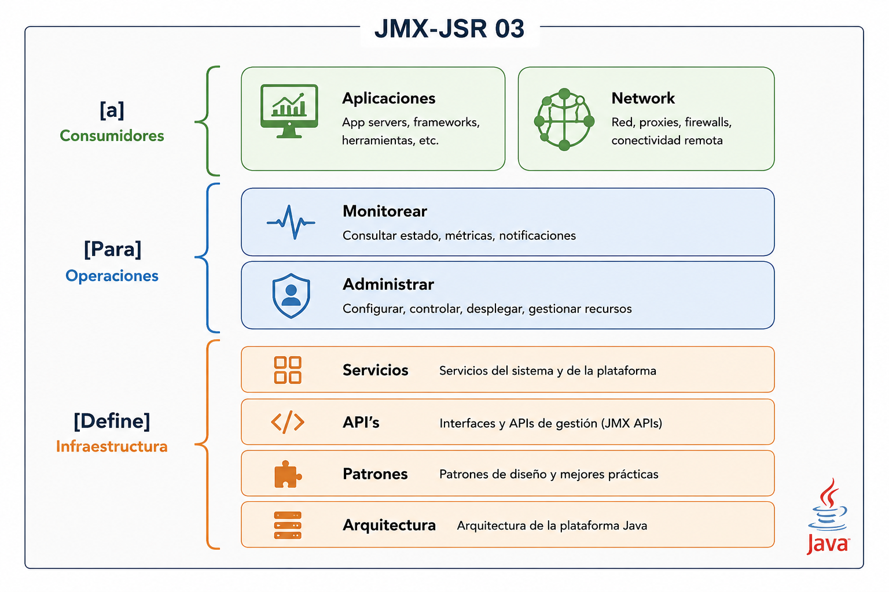

_Figura 1. El objetivo de la JSR 03 visto de manera gráfica._


Si recuerdas tus clases de compiladores, puedes darte cuenta que, la imagen anterior bien puede convertirse en:

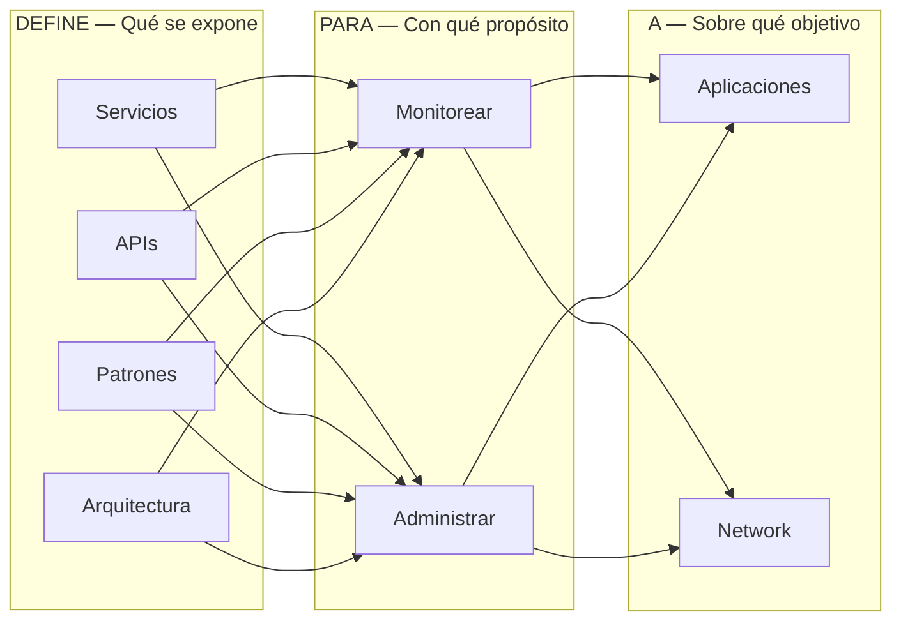
_Diagrama 1. Todo lo que podemos hacer con JMX._


Lo primero que llama la atención es que, la especificación incluye el monitoreo de redes, algo que muy pocos sabemos o pensamos que se podríahacer con JMX.

## ¿Por qué usar JMX?
Este es el listado de beneficios que se mencionan se obtienen al utilizar JMX:

* Permite gestionar las aplicaciones Java sin invertir grandes esfuerzos.
* Proporciona una arquitectura de administración escalable.
* Se integra a soluciones de supervisión existentes.
* Aprovecha las tecnologías Java estándar ya existentes.
* Puede aprovechar a futuro conceptos de supervisión.
* Define sólo las interfaces necesarias para la supervisión.

En la práctica, los beneficios se van observando conforme se aumenta su uso.

Es claro que son muchas las aplicaciones que la utilizan, principalmente en el mundo JEE, pero su uso no está limitado a este subconjunto de especificaciones. 

Aplicaciones de escritorio, embebidas y remotas le sacan también provecho a esta tecnología.

## Visión general.
La especificación continúa dándonos un resumen tanto de la arquitectura como de los componentes que la conforman.

## Arquitectura.
La arquitectura es sencilla, son 3 los niveles de abstracción que se utilizan.

### Los 3 niveles de la especificación.
La especificación requiere 3 niveles de abstracción:
* Instrumentación.
* Agente.
* Servicios distribuidos.

Estos 3 niveles en conjunto son los que se encargan de que la especificación pueda funcionar.


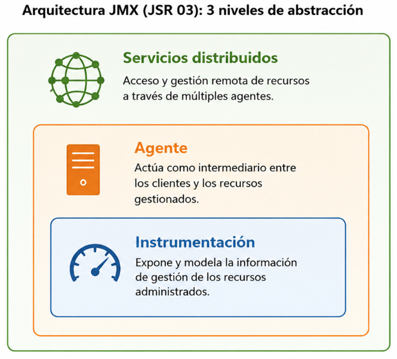

_Figura 2. Los 3 niveles de abstracción de la JSR 03._

Los niveles pueden verse siguiendo esa jerarquía, de arriba hacia abajo (abajo la más sencilla y sube en complejidad), para indicar la secuencia quese debe seguir para poder implementar o usar JMX en nuestras aplicaciones java.

Demos un repaso de cada nivel.

### Nivel de instrumentación.

El primer nivel, el de instrumentación proporciona las especificaciones requeridas para implementar: JMX manageable resources, algo quepodríamos traducir como: recursos
supervisables JMX (dejaremos el nombre en inglés para mantener la referencia con otros documentos).

Un _JMX manageable resource_ puede ser:

* Una aplicación.
* Una implementación de un servicio.
* Un dispositivo.
* Un usuario.
* Étcetera.

Está desarrollado en java o al menos ofrece un punto de acceso vía java, además de que ha sido instrumentado para ser supervisado poraplicaciones compatibles con JMX.
La pieza clave de este nivel son los Managed Beans, o MBeans.

Los MBeans pueden ser de tipo:
* Standard
* Dynamic

El tipo standard es el más sencillo, se basa en la especificación para los JavaBeans, el tipo Dynamic es más complejo y a cambio de esa complejidad ofrece una mayor flexibilidad en tiempo de ejecución.

Un _JMX manageable resource_ puede estar cubierto por uno o más MBeans.
Este nivel, además de los MBeans define las especificaciones para proporcionar un mecanismo de notificación. Este mecanismo de notificación permite a los MBeans generar y propagar eventos de notificación hacia componentes de los otros dos niveles.

Como todo nivel jerárquico, los elementos de este nivel, los _JMX manageable resource_ son manejados (de manera automática) por el siguientenivel: los agentes.

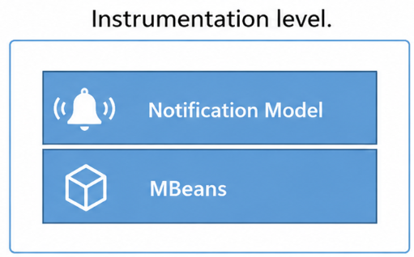

_Figura 3. Nivel de instrumentación y sus componentes._

### Nivel de agentes.

En este nivel se define todo lo relacionado con los agentes. Aquí es donde se gestiona el <JMX manageable resource> y se hace lo necesario paraque pueda ser manipulable de manera remota.

Este nivel recibe los MBeans y los gestiona automáticamente, los agentes generalmente están en la misma máquina que los <JMX manageableresource> pero esto no necesariamente es así.

Este nivel se puede englobar en dos grandes componentes:

* El MBean Server
* Servicios para manipular los MBeans.

Para ir familiarizándonos con la tecnología, tanto el servidor de MBeans como nuestro _JMX manageable resource_ a instrumentar vivirán en laJVM, pero, lo realmente poderoso de JMX es tener al servidor en otro contexto de ejecución.

Para ello la especificación agrega dos conceptos: Adaptadores y conectores, son componentes de comunicación que permiten unir al Server MBeancon el resto del mundo. Por ahora sólo es necesario que conozcamos de su existencia.

Como en el nivel anterior, este nivel solo se _"preocupa"_ por cumplir su parte de la especificación y los niveles adyacentes se encargarán de trabajaren conjunto.

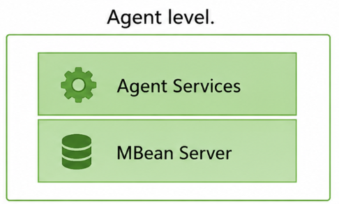

_Figura 4. Nivel de Agente y sus componentes._

### Nivel de servicios distribuidos.

Este último nivel proporciona un conjunto de interfaces para implementar _JMX managers_.

En este nivel se definen una serie de interfaces cuyas tareas son:

* Proporcionar una interface para supervisar aplicaciones, para interactuar de manera transparente con el agente y los recursos que administra através de un conector.
* Distribuir información para la supervisión desde plataformas de supervisión de alto nivel hacia varios agentes JMX.
* Consolidar la información de supervisión procedente de numerosos agentes JMX en vistas lógicas que son relevantes para las operacionescomerciales del usuario final.
* Proveer seguridad.

En este nivel se implementan mecanismos de cooperación a través de la red, es justo aquí donde se proporcionan implementan las funcionalidadesde distribución, escalabilidad y supervisión. 

Es aquí también dónde se construyen las extensiones y demás mecanismos para hace de estatecnología adaptable, dinámica y segura.

## Componentes.

Ahora, ya que conocemos los niveles de abstracción, lo que sigue es conocer a detalle que componentes conforman cada uno de estos niveles.

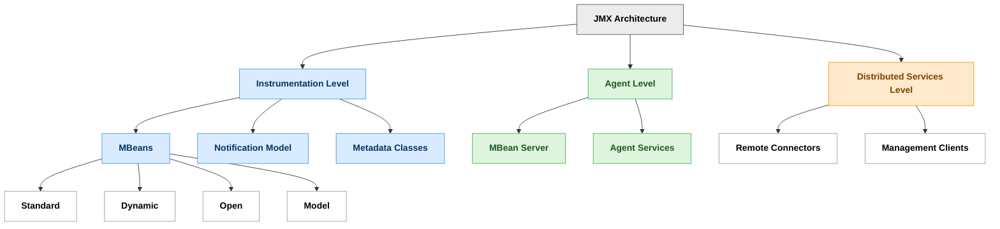

_Figura 5. Visión general de los componentes que conforman la especificación JMX.._


Como podemos ver, es el nivel de instrumentación el que tiene más componentes a revisar, además del modelo de notificación es necesarioconocer los tipos de MBeans que se pueden implementar.
Por último, para terminar con este gran resumen; la siguiente imagen muestra con más detalle la relación entre componentes y cada uno de losniveles de arquitectura.

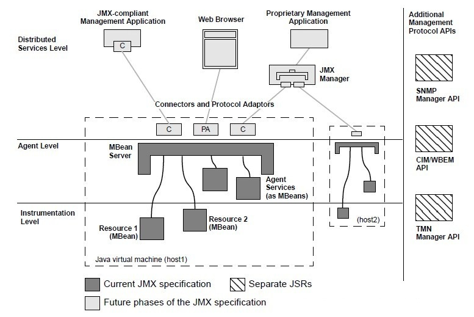

_Figura 6. Relación entre componentes y los niveles que forman la especificación JMX. Imagen tomada del documento oficial._

Esta última imagen puede parecer un poco compleja, pero, como veremos, la complejidad puede manejarse muy bien aislando los componentes yrevisándolos uno a uno.

Por ello, iniciaremos con el primer nivel, el de instrumentación. Crearemos un Mbean standard y conoceremos una manera sencilla para interactuarcon él.

_Manos a la obra._

## El 1er nivel.

### Nivel de instrumentación.

El primer nivel de la especificación es este, el de instrumentación, es el más ligero. Aquí es dónde se definen los recursos que queremosadministrar.

La pieza clave de este nivel es el MBean. Así que, veamos de que se trata.

### Managed MBean.

En términos sencillos, un MBean es una clase java que implementa una interface en específico y sigue cierto patrón en su implementación. Elobjetivo de seguir estas reglas es que el nivel superior, el nivel de agentes, pueda manipularlo de manera automática sin problemas; muy a su estiloJava ya tenía su manera de hacer
Convention over Configuration.

El objetivo es que el MBean defina de manera sencilla e inequívoca:

* Operaciones que puedan ser invocadas.
* Atributos que puedan ser accedidos.
* Notificaciones que puedan ser emitidas
* Constructores que puedan ser utilizados.

Los atributos siguen la convención que todos conocemos, si queremos tener un atributo en nuestro MBean debemos proporcionar un _getter_ y un _setter_ para cada uno de ellos.

Todo lo que definamos (siguiendo las reglas) en el MBean estará disponible para el agente.

La especificación define 4 tipos de MBeans.

| Tipo | ¿Cuándo usarlo? | Características |
|------|-----------------|-----------------|
| **Standard MBean** | Cuando el recurso es estable y conocido desde el diseño. | Fácil de implementar, interfaz fija y tipado fuerte. |
| **Dynamic MBean** | Cuando los atributos u operaciones pueden cambiar en tiempo de ejecución. | Flexible, implementa `DynamicMBean`, mayor complejidad. |
| **Open MBean** | Cuando el recurso debe ser interoperable con herramientas genéricas de gestión. | Usa `Open Types`, es auto-descriptivo y portable. |
| **Model MBean** | Cuando se requiere máxima configurabilidad sin modificar el código. | Configurable, auto-descriptivo y orientado a componentes reutilizables. |


### Notification Model.
Este nivel de la especificación define también un modelo genérico de notificación basado en el modelo de eventos de java. Las notificaciones laspuede emitir tanto un MBean como un server de MBeans.
La especificación define:

* Los objetos para realizar la notificación
* Interfaces para implementar los _Listeners_.
* Interfaces para implementar el _broadcast_.

Esto tanto para los que envían como los que reciben las notificaciones. Aquí también se definen los servicios necesarios para que estasnotificaciones puedan ser funcionales de manera remota.
MBean Metadata Classes.

Todos los anteriores MBean realmente extienden a este MBean. Estás clases contienen la estructura que describen todos los componentes de lainterface que maneja los MBeans, esto es:
* Atributos
* Operaciones
* Notificaciones y
* Constructores.

Es el servidor de MBean el que proporciona todos estos metadatos, y el que se encarga de implementarlos.

Ahora, continuamos revisando una herramienta que seguramente ya has utilizado.

## JConsole

JConsole es la herramienta que proporciona el JDK para poder acceder a los servidores de MBeans, como vimos anteriormente, es en estos servidores donde se hospedan los MBeans.
JConsole permite acceder tanto servidores locales como remotos, iniciaremos primero conociendo como conectarnos a un servidor local y enentregas posteriores veremos cómo conectarnos a servidores remotos.

### Iniciando.

Si tienes en el PATH local la carpeta /bin del JDK, solamente hay que escribir en una ventana de comandos:

``` bash
%>jconsole
```
Si no te reconoce el comando, debes agregar la carpeta bin de tu JDK al PATH, o acceder directamente a la carpeta y escribir:

``` bash
path_jdk/bin%>jconsole
```
o
``` powershell
path_jdk/bin%>jconsole.exe
```


Esto abrirá JConsole. La 1er pantalla nos permite elegir entre los procesos locales que están ejecutándose sobre nuestra JVM, todos ellos hacenuso de un servidor MBean local.

Vamos a conectarnos al proceso del propio JConsole. Es decir, usaremos JConsole, para revisar JConsole ;) .

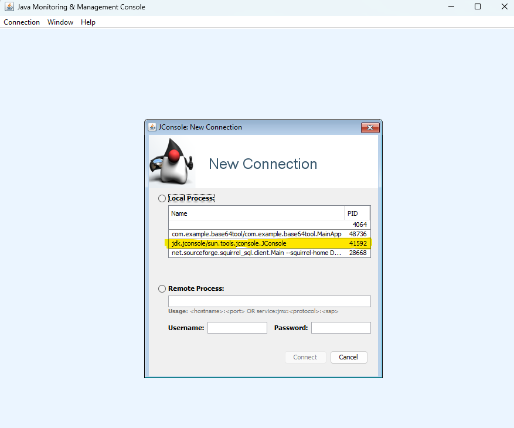

_Figura 7. La propia JConsole tiene expuestos MBeans para poder supervisarla._

Después de hacer doble _click_ sobre el proceso al cual nos queremos conectar nos va a aparecer una advertencia de seguridad, esto se debe a que el servidor local de _MBeans_ por
_ default_ no están asegurados.

El aseguramiento de servidores de MBeans es un tema que se verá posteriormente.

 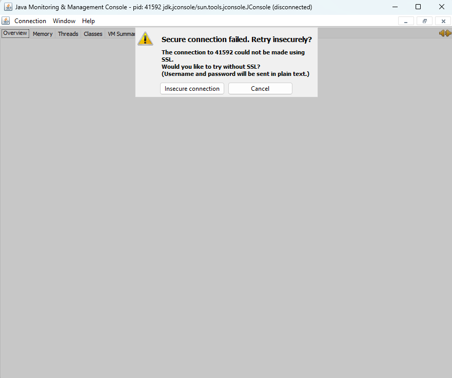
 
_Figura 8. Advertencia de que la conexión segura no fue posible de realizar._


Debemos aceptar que usaremos una conexión insegura. Con esto, podemos continuar.

La primera pantalla que vemos nos muestra el consumo de recursos de JConsole, en la parte superior podemos ver todas las  fichas/tabs que ofrece la IU.

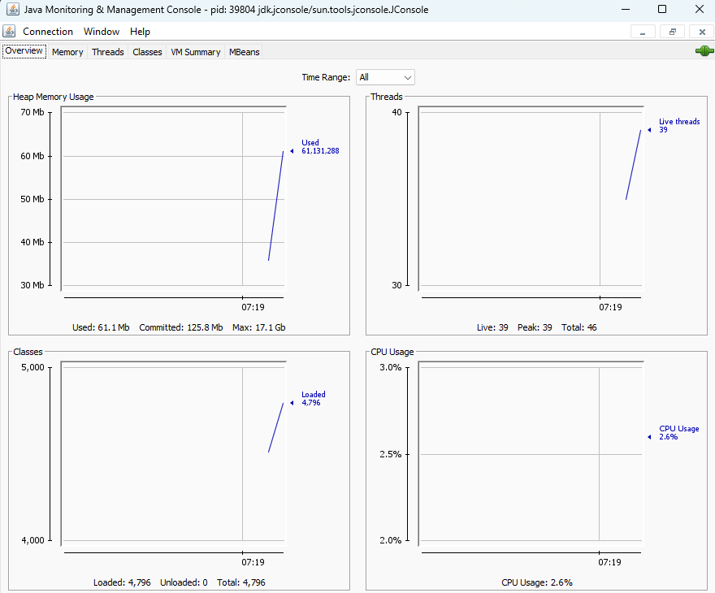

_Figura 9. Monitor principal del JConsole._

La pantalla inicial seguramente es ya conocida, nos muestra indicadores de desempeño del proceso: heap, threads, clases cargadas, y uso de CPU.

Hasta la derecha, podemos ver la ficha relacionada a los MBeans.
Como se puede ver, la lista de MBeans es extensa y se encuentran organizados en forma de árbol.

### Listado de MBeans disponibles.

El listado que aparece en esta pestaña representa todos los MBeans disponibles en esta conexión.

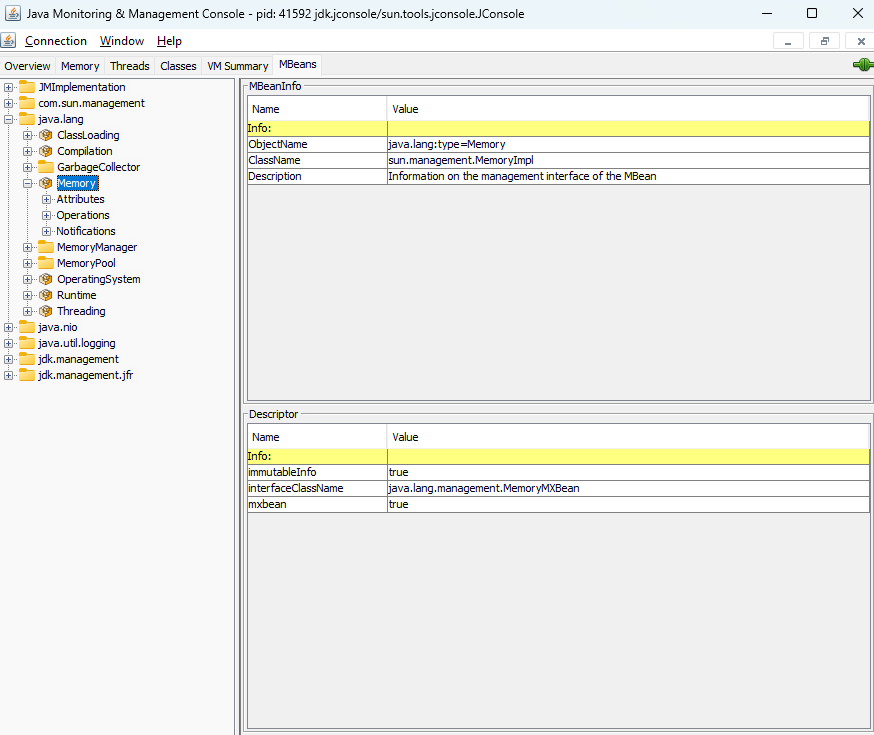

_Figura 10. Ficha MBeans dentro de JConsole, mostrando los MBeans disponibles._

Hay un MBean debajo de `java.lang`, llamado `Memory`, si hacemos _click_ sobre el `MBean` podemos ver sus principales propiedades, entre ellas hay una llamada _Object Name_, conoceremos en un momento su importancia.

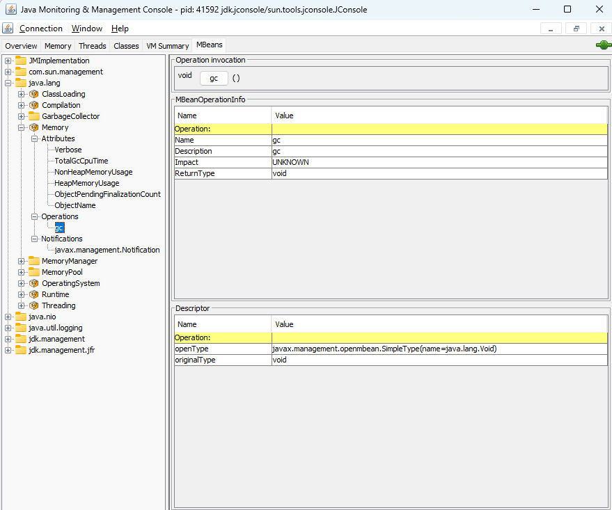

_Figura 11. El object name del MBean que opera sobre la memoria._

Ahora, si hacemos click en él podremos ver las operaciones que expone.

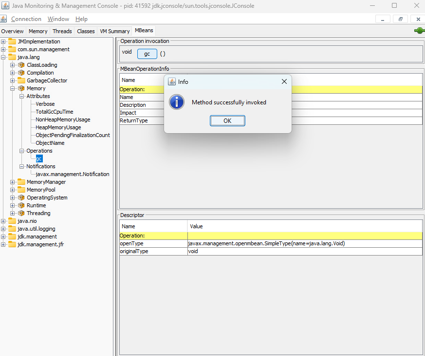

_Figura 12. Existe un MBean que permite invocar el Garbage Collector._

La operación invoca al Garbage Collector _(realmente, como sabemos, GC() sólo sugiere la invocación, es la JVM la que decide ejecutarla o no)_.

Si hacemos _click_ en el botón, se realiza la invocación, y si regresamos a la pestaña inicial podremos ver los efectos.

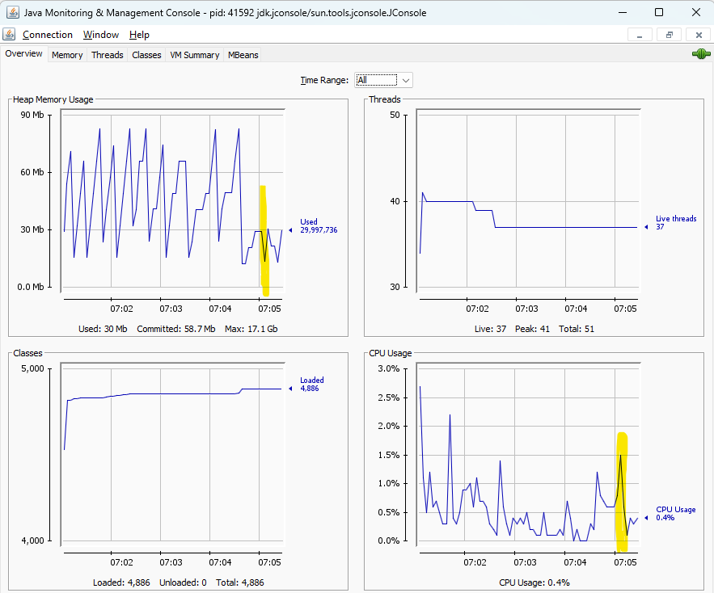

_Figura 13. Los efectos de invocar el Garbage Collector._

El tamaño de la memoria disminuye, pero, tiene un costo: uso de CPU.

Podemos cerrar JConsole, más adelante lo volveremos a usar.

### Nuestro primer MBean standard.

Ahora que ya sabemos cómo crear un MBean Standard, y ya sabemos cómo interactuar con uno usando JConsole, lo que necesitamos es unaaplicación que podamos monitorear y/o administrar.
Usaremos una aplicación sencilla, será sólo una clase java.

Esta clase te resultará conocida, es el ejemplo clásico para manejo de ciclos, en este caso un do-while.

El ejemplo hace uso de la clase Scanner para esperar una entrada por el teclado.

Una vez que se recibe la entrada de teclado (texto seguido de ENTER) se compara con una palabra de control, la cual termina con el ciclo. Si lapalabra introducida no es la palabra de control, el ciclo continúa.

Nos apoyamos en una clase llamada Adivina, el objetivo de esta clase es ir almacenando las palabas que se van introduciendo, además de guardarel valor de la palabra de control.

Tiene dos métodos que nos ayudan a saber el número de palabas introducidas y la lista de las mismas.

Un ejemplo muy sencillo pero suficiente para mostrar el uso de un MBean standard.

### Nuestro ejemplo.

``` java 
package mx.sps.juegos;
import java.lang.management.ManagementFactory; 
import java.util.ArrayList; 
import java.util.List; 
import java.util.Scanner; 
import javax.management.MBeanServer; 
import javax.management.ObjectName;

import mx.sps.mbeans.Control;

/** * * @author RuGI (S&P Solutions) */ 
public class Adivina {

    private List<String> words;
    private StringBuffer endControl;

    public Adivina(List<String> words, String endWord) {
        super();
        this.words = words;
        this.endControl = new StringBuffer(endWord);
    }

    public void addWord(String word) {
        this.words.add(word);
    }

    public int getNumberWords() {
        return this.words.size();
    }

    public List<String> getWords() {
        return this.words;
    }

    public static void main(String[] args) throws Exception {
        Adivina adivina = new Adivina(new ArrayList<String>(), "END");
        Scanner keyboard = new Scanner(System.in);
        String input;
        do {
            input = keyboard.nextLine();
            System.out.println("Escribiste:" + input);
            adivina.addWord(input);
        } while (!input.equals(adivina.endControl.toString()));
        System.out.println("Adivinaste en [" + adivina.getNumberWords() + "] intentos.");
    }//main
}//class
```
