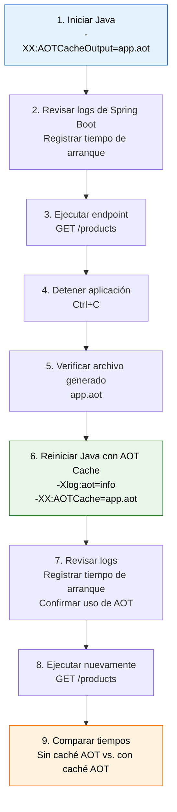

## AOT Cache

```mermaid
flowchart TD
    A["1. Iniciar Java<br/>-XX:AOTCacheOutput=app.aot"]
    B["2. Revisar logs de Spring Boot<br/>Registrar tiempo de arranque"]
    C["3. Ejecutar endpoint<br/>GET /products"]
    D["4. Detener aplicación<br/>Ctrl+C"]
    E["5. Verificar archivo generado<br/>app.aot"]
    F["6. Reiniciar Java con AOT Cache<br/>-Xlog:aot=info<br/>-XX:AOTCache=app.aot"]
    G["7. Revisar logs<br/>Registrar tiempo de arranque<br/>Confirmar uso de AOT"]
    H["8. Ejecutar nuevamente<br/>GET /products"]
    I["9. Comparar tiempos<br/>Sin caché AOT vs. con caché AOT"]

    A --> B
    B --> C
    C --> D
    D --> E
    E --> F
    F --> G
    G --> H
    H --> I

    style A fill:#E3F2FD,stroke:#1565C0,color:#000
    style F fill:#E8F5E9,stroke:#2E7D32,color:#000
    style I fill:#FFF3E0,stroke:#EF6C00,color:#000
```
